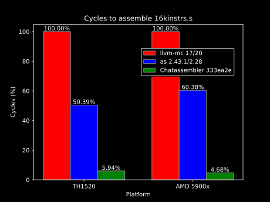

# Welcome to `libchata`!

`libchata` is the core library behind Chata. It handles compiling, assembling, and execution of Chata code. The assembler, Chatassembler, can assemble most RISC-V assembly, not just the kind generated from Chata code, so you can use `libchata` just for that if you wish!

## Quick Start

> [!WARNING]
> Most of libchata is currently WORK IN PROGRESS. Anything could change right now. However, Chatassembler is ready for real world usage!

# Welcome to Chatassembler!

Chatassembler is the bloat-free assembler library for RISC-V. It's easy to use, fully independent of GCC and LLVM, and _over 10x faster_ 🏎️ than them.

<p align="center">
    
</p>

Here's more on that. Chatassembler is...

### ▫️ Complete

Supports all instructions in the RV32I, RV64I, RV32M, RV64M, RV32A, RV64A, RV32F, RV64F, RV32D, RV64D, RV32Q, RV64Q, RV32Zfh, RV64Zfh, Zifencei, Zicsr, Zawrs, Zicond, Zacas, Zcb, Zcmp, Zcd, Zbb **(WIP)**, Zcf, Zcmt, Zfa, B **(WIP)**, and V **(WIP)** instruction sets, pseudoinstructions, custom instructions, labels, and many other directives **(WIP)**. 

The endgame is full compatibility with GCC's `as` excluding certain features (more below).

### ▫️ Not a binary

Chatassembler ships in the lean and mean `libchata` library and is also available in the `chatacli` tool. Use it anywhere C++20 is supported and link it dynamically or statically. It's your choice.

### ▫️ Zero config

There's only one (1) function with one (1) required parameter. Truly effortless.

### ▫️ Unrelated to GCC or LLVM

Chatassembler shares zero (0) code with GCC or LLVM. That means we can make it a third reference implementation of RISC-V assembly!

### ▫️ Verified quality

The Chatassembler testsuite currently has 610+ tests covering all supported instructions and directives and other cases too.

Interestingly, this has led to Chatassembler revealing lots of bugs in `as` including ones causing internal errors!

### ▫️ Fast! 🏎️

Chatassembler uses a strategy similar to what the fast `mold` linker also uses: more efficient data structures and algorithms. Unlike `mold`, however, Chatassembler doesn't use multithreading, but it doesn't need to. **Coming soon: How is Chatassembler so fast?**

On my desktop with a Zen 3 CPU and GCC 11, Chatassembler is approximately 13x faster than `as` and 9x faster on my RISC-V SBC with a TH1520 SoC and GCC 14, both assembling the `16kinstrs.s` sample file, measured in number of cycles.

## Differences to `as` and `llvm-mc`

Chatassembler is different to `as` and `llvm-mc` in these important ways:

### ▫️ Machine code

Chatassembler can only generate RISC-V machine code. It can't make ELF or other executable files. 

In other words, Chatassembler replaces what you would otherwise do with `as foo.s && objcopy -O binary a.out`.

### ▫️ Directive support

Because Chatassembler only generates RISC-V machine code, it ignores directives such as `.align` and `.globl` which only make sense with executable files.

Here's a table of what [directives](https://github.com/riscv-non-isa/riscv-asm-manual/blob/main/src/asm-manual.adoc) Chatassembler supports as of the latest commit:

☑️ = Supported

🪛 = WIP

❌ = Not Supported Yet

💀 = Irrelevant to Chatassembler

| Directive | Status |
|-----------|--------|
| `.align` | 💀 |
| `.attribute` | 💀 |
| `.option rvc/norvc` | 💀 |
| `.option arch` | ☑️ |
| `.option pic/nopic` | 💀 |
| `.option relax/norelax` | 💀 |
| `.option push/pop` | ☑️ |
| `.insn <value>` | ☑️ |
| `.insn <insn_length>, <value>` | ☑️ |
| `.insn <type> <fields>` | ☑️ |
| Relocation functions | `%hi(symbol)`: ☑️ <br> `%lo(symbol)`: ☑️ <br> Others: 💀 |
| Labels | ☑️ |
| Absolute addressing | 💀 |
| Relative addressing | 💀 |
| GOT-indirect addressing | 💀 |
| Load Immediate | ☑️ |
| Load Upper Immediate’s Immediate | ☑️ |
| Signed Immediates for I- and S-Type Instructions | ☑️ |
| Floating-point literals | ☑️ |
| Load Floating-point Immediate | `fli`: ☑️ <br> `.float`: 💀 <br> `.double`: 💀 |
| Load Address | 💀 |
| Load Local Address | 💀 |
| Load Global Address | 💀 |
| Load and Store Global | 💀 |
| Constants | 🪛 |
| Far Branches | ❌ |
| Function Calls | ☑️ |
| Floating-point rounding modes | ☑️ |
| Control and Status Registers | ☑️ |
| Standard pseudoinstructions | ☑️ |
| CSR pseudoinstructions | ☑️ |

### ▫️ License

Chatassembler is available with the MPL 2.0 license. This may or may not be easier to include in your project than the GPL, but this depends on your situation.

### ▫️ More flexible

For some instructions, `as` only supports `(reg)` as a way to represent the value at the address stored in register `reg`. However, `reg` and `0(reg)` have the same effect, so Chatassembler supports those in addition to `(reg)`. For example, `as` will reject `lr.w a0, a1` and `lr.w a0, 0(a1)`, but Chatassembler won't. 

In general, Chatassembler accepts other instructions that `as` would reject because the RISC-V standard doesn't forbid them. Another example is with `.insn`, where `as` places constraints on the opcode field, but such constraints on custom instructions do not exist in the standard.

## Why Chatassembler?

I wrote Chatassembler because Chata needs to generate RISC-V machine code to execute at runtime, FAST. Until now, the only way to do this was to manually invoke `as` and `objcopy` in a funky and inefficient way. This was because there were no good, independent RISC-V assembler libraries. But now, Chatassembler can do the same thing much faster, much easier, and much prettier.

I was originally going to include Chatassembler as an entirely private part of the `libchata` library that you wouldn't be able to use on its own. However, I realized that with how useful an independent RISC-V assembler might turn out to be, you should be able to use Chatassembler independently of the rest of the Chata project. That's what you're seeing here.

One example of where you want to use Chatassembler is with embedded RISC-V scripts where you would also use [libriscv](https://github.com/libriscv/libriscv).

## Quick Start

### ▫️ Installation

Start by installing `libchata` how you would normally with the instructions in the `libchata` section.

Then, include the line `#include <libchata.hpp>` where you use Chatassembler.

Support for other languages is planned!

### ▫️ Usage

The one function of Chatassembler is

```cpp
std::span<uint8_t> libchata_assemble(std::string_view code, std::span<RVInstructionSet> supported_sets = {})
```

where `code` is your RISC-V assembly code and `supported_sets` is optionally an array of `RVInstructionSet` enums. It returns an array of bytes of RISC-V machine code. The following is the list of supported instruction sets:

```cpp
enum class RVInstructionSet : uint8_t {
    RV32I,
    RV64I,
    RV32M,
    RV64M,
    RV32A,
    RV64A,
    RV32F,
    RV64F,
    RV32D,
    RV64D,
    RV32Q,
    RV64Q,
    RV32Zfh,
    RV64Zfh,
    Zifencei,
    Zicsr,
    Zawrs,
    Zicond,
    Zacas,
    Zcb,
    Zbb,
    Zcmp,
    C,
    Zcd,
    Zcf,
    Zcmt,
    Zfa,
    B,
    V
};
```

Include instruction sets if:

- You're assembling code which uses the `bclri` or `rev8` instructions, which are different on 64 bit systems than 32.
- You're assembling code which uses the `.option arch` directive, which requires knowing the target instruction sets.

If you include instruction sets, you must include at least either `RV32I` or `RV64I`.

By default, the `bclri` and `rev8` instructions target a 32 bit system.

To preserve performance, Chatassembler doesn't check if instructions outside of `.option arch` blocks are valid for the provided instruction sets. If this is a problem for you, fix your broken software.

### ▫️ Exceptions

Chatassembler may throw a `ChataError` exception if it encounters incorrect code or has some other error.

To catch these, just add a `try {} catch(...) {}` block like you would with other C++ code.

These errors follow the same format that other parts of `libchata` use.

### ▫️ Example

```cpp
#include <libchata.hpp>
#include <string_view>
#include <vector>

int main() {
    using enum RVInstructionSet;

    std::vector<RVInstructionSet> my_enums = {RV32I, C};

    std::string_view my_code = "addi a0, a0, 10\n"
    "sub a0, a0, a1\n"
    "ret";

    auto machine_code1 = libchata_assemble(riscv_code);

    auto machine_code2 = libchata_assemble(riscv_code, {RV32I});

    auto machine_code3 = libchata_assemble(riscv_code, my_enums);

    try {
        auto caught_code = libchata_assemble(riscv_code);
    } catch (ChataError& e) {
        // Handle your error!
    }
}
```

This concludes all of the public functionality of Chatassembler.
