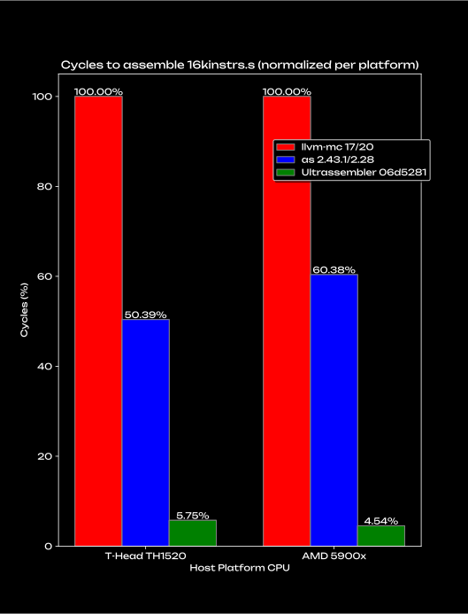

# Welcome to Ultrassembler!

Ultrassembler is the world's #1 (and only) complete assembler library for RISC-V. It's easy to use, fully independent of GCC and LLVM, and _over 10x faster_ 🏎️ than them.

<p align="center">
    
</p>

Here's more on that. Ultrassembler is...

### ▫️ Complete

Supports all 1100+ instructions in these RISC-V instruction sets!

- RV32E
- RV32I
- RV64I
- RV32M
- RV32A
- RV64A
- RV32F
- RV64F
- RV32D
- RV64D
- RV32Q
- RV64Q
- RV32Zfh
- RV64Zfh
- B
- V
- C
- Zifencei
- Zicsr
- Zawrs
- Zicond
- Zacas
- Zcb
- Zbb
- Zcmp
- Zcd
- Zcf
- Zcmt
- Zfa
- Zimop
- Zbkb
- Zbkc
- Zbkx
- Zknd
- Zkne
- Zknh
- Zksed
- Zksh
- Zkr
- Zkn
- Zks
- Zk
- Zkt
- Zvbb
- Zvbc
- Zvkb
- Zvkg
- Zvkned
- Zvknh
- Zvknhab
- Zvknhb
- Zvksed
- Zvkn
- Zvknc
- Zvkng
- Zvks
- Zvksc
- Zvksg
- Zvkt
- Zvksh
  
This includes pseudoinstructions, custom instructions, labels, and many other assembler directives!

The endgame is full compatibility with GCC's `as` excluding certain features (more below).

### ▫️ Not a binary

Ultrassembler ships in the lean and mean `ultrassembler` library and is also available in the `chatacli` tool. Use it anywhere C++20 is supported and link it dynamically or statically. It's your choice.

### ▫️ Zero config

There's only one (1) function with one (1) required parameter. Truly effortless.

### ▫️ Independent of GCC and LLVM

Ultrassembler shares zero (0) code with GCC or LLVM. That means we can make it a third reference implementation of RISC-V assembly!

### ▫️ Verified quality

The Ultrassembler testsuite currently has 1700+ tests covering all supported instructions and directives and other cases too.

This has led to Ultrassembler revealing lots of bugs in `as` including ones causing internal errors!

### ▫️ Fast! 🏎️

Ultrassembler uses a strategy similar to what the fast `mold` linker also uses: more efficient data structures and algorithms. Unlike `mold`, however, Ultrassembler doesn't use multithreading, but it doesn't need to. **Coming soon: How is Ultrassembler so fast?**

On my desktop with a Zen 3 CPU and GCC 11, Ultrassembler is approximately 13x faster than `as` and 9x faster on my RISC-V SBC with a TH1520 SoC and GCC 14, both assembling the `16kinstrs.s` sample file, measured in number of cycles.

## Differences to `as` and `llvm-mc`

Ultrassembler is different to `as` and `llvm-mc` in these important ways:

### ▫️ Machine code

Ultrassembler can only generate RISC-V machine code. It can't make ELF or other executable files. 

In other words, Ultrassembler replaces what you would otherwise do with `as foo.s && objcopy -O binary a.out`.

### ▫️ Directive support

Because Ultrassembler only generates RISC-V machine code, it ignores directives such as `.align` and `.globl` which only make sense with executable files.

Here's a table of what [directives](https://github.com/riscv-non-isa/riscv-asm-manual/blob/main/src/asm-manual.adoc) Ultrassembler supports as of the latest commit:

☑️ = Supported

🪛 = WIP

❌ = Not Supported Yet

💀 = Irrelevant to Ultrassembler

| Directive                                        | Status                                                |
| ------------------------------------------------ | ----------------------------------------------------- |
| `.align`                                         | 💀                                                     |
| `.attribute`                                     | 💀                                                     |
| `.option rvc/norvc`                              | 💀                                                     |
| `.option arch`                                   | 🪛                                                     |
| `.option pic/nopic`                              | 💀                                                     |
| `.option relax/norelax`                          | 💀                                                     |
| `.option push/pop`                               | ☑️                                                     |
| `.insn <value>`                                  | ☑️                                                     |
| `.insn <insn_length>, <value>`                   | ☑️                                                     |
| `.insn <type> <fields>`                          | ☑️                                                     |
| Relocation functions                             | `%hi(symbol)`: ☑️ <br> `%lo(symbol)`: ☑️ <br> Others: 💀 |
| Labels                                           | ☑️                                                     |
| Absolute addressing                              | 💀                                                     |
| Relative addressing                              | 💀                                                     |
| GOT-indirect addressing                          | 💀                                                     |
| Load Immediate                                   | ☑️                                                     |
| Load Upper Immediate’s Immediate                 | ☑️                                                     |
| Signed Immediates for I- and S-Type Instructions | ☑️                                                     |
| Floating-point literals                          | ☑️                                                     |
| Load Floating-point Immediate                    | `fli`: ☑️ <br> `.float`: 💀 <br> `.double`: 💀           |
| Load Address                                     | 💀                                                     |
| Load Local Address                               | 💀                                                     |
| Load Global Address                              | 💀                                                     |
| Load and Store Global                            | 💀                                                     |
| Constants                                        | ☑️                                                     |
| Far Branches                                     | ❌                                                     |
| Function Calls                                   | ☑️                                                     |
| Floating-point rounding modes                    | ☑️                                                     |
| Control and Status Registers                     | ☑️                                                     |
| Standard pseudoinstructions                      | ☑️                                                     |
| CSR pseudoinstructions                           | ☑️                                                     |

### ▫️ License

Ultrassembler is available with the MPL 2.0 license. This may or may not be easier to include in your project than the GPL, but this depends on your situation.

### ▫️ More flexible

For some instructions, `as` only supports `(reg)` as a way to represent the value at the address stored in register `reg`. However, `reg` and `0(reg)` have the same effect, so Ultrassembler supports those in addition to `(reg)`. For example, `as` will reject `lr.w a0, a1` and `lr.w a0, 0(a1)`, but Ultrassembler won't. 

In general, Ultrassembler accepts other instructions that `as` would reject because the RISC-V standard doesn't forbid them. Another example is with `.insn`, where `as` places constraints on the opcode field, but such constraints on custom instructions do not exist in the standard.

## Why Ultrassembler?

I wrote Ultrassembler because Chata needs to generate RISC-V machine code to execute at runtime, FAST. Until now, the only way to do this was to manually invoke `as` and `objcopy` in a funky and inefficient way. This was because there were no good, independent RISC-V assembler libraries. But now, Ultrassembler can do the same thing much faster, much easier, and much prettier.

I was originally going to include Ultrassembler as an entirely private part of the `ultrassembler` library that you wouldn't be able to use on its own. However, I realized that with how useful an independent RISC-V assembler might turn out to be, you should be able to use Ultrassembler independently of the rest of the Chata project. That's what you're seeing here.

One example of where you want to use Ultrassembler is with embedded RISC-V scripts where you would also use [libriscv](https://github.com/libriscv/libriscv).

## Quick Start

### ▫️ Installation

Start by installing `ultrassembler` how you would normally with the instructions in the `ultrassembler` section.

Then, include the line `#include <ultrassembler.hpp>` where you use Ultrassembler.

Support for other languages is planned!

### ▫️ Usage

The one function of Ultrassembler is

```cpp
std::span<uint8_t> ultrassembler_assemble(std::string_view code, std::span<RVInstructionSet> supported_sets = {})
```

where `code` is your RISC-V assembly code and `supported_sets` is optionally an array of `RVInstructionSet` enums. It returns an array of bytes of RISC-V machine code. The following is the list of supported instruction sets:

```cpp
enum class RVInstructionSet : uint8_t {
    RV32I,
    RV64I,
    RV32M,
    RV64M,
    RV32A,
    RV64A,
    RV32F,
    RV64F,
    RV32D,
    RV64D,
    RV32Q,
    RV64Q,
    RV32Zfh,
    RV64Zfh,
    Zifencei,
    Zicsr,
    Zawrs,
    Zicond,
    Zacas,
    Zcb,
    Zbb,
    Zcmp,
    C,
    Zcd,
    Zcf,
    Zcmt,
    Zfa,
    B,
    V
};
```

Include instruction sets if:

- You're assembling code which uses the `bclri`, `rev8`, `cm.push*`, or `cm.pop*` instructions, which are different on 32 bit systems than 64, and you're targeting a 32 bit system.
- You're assembling code which uses the `.option arch` directive, which requires knowing the target instruction sets.
  
By default, Ultrassembler targets a 64 bit `RV64I` system.

If you include instruction sets, you must include at least `RV32E`, `RV32I`, or `RV64I`.

To preserve performance, Ultrassembler doesn't check if instructions outside of `.option arch` blocks are valid for the provided instruction sets. If this is a problem for you, fix your broken software.

### ▫️ Exceptions

Ultrassembler may throw a `UltraError` exception if it encounters incorrect code or has some other error.

To catch these, just add a `try {} catch(...) {}` block like you would with other C++ code.

These errors follow the same format that other parts of `ultrassembler` use.

### ▫️ Example

Check out this example of how to use Ultrassembler for yourself.

```cpp
#include <ultrassembler.hpp>
#include <string_view>
#include <vector>

int main() {
    using enum RVInstructionSet;

    std::vector<RVInstructionSet> my_enums = {RV32I, C};

    std::string_view my_code = 
    "addi a0, a0, 10\n"
    "sub a0, a0, a1\n"
    "ret";

    auto machine_code1 = ultrassembler::assemble(my_code);

    std::span<uint8_t> machine_code2 = ultrassembler::assemble(my_code, my_enums);

    try {
        auto caught_code = ultrassembler::assemble(my_code);
    } catch (UltraError& e) {
        // Handle your error!
    }
}
```

You can build this example by copying [the code file](ultrassembler_example.cpp) and then running

```sh
g++ -std=c++23 ultrassembler_example.cpp -lchata -luas
```

This concludes all of the public functionality of Ultrassembler.


